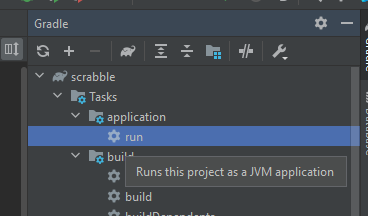
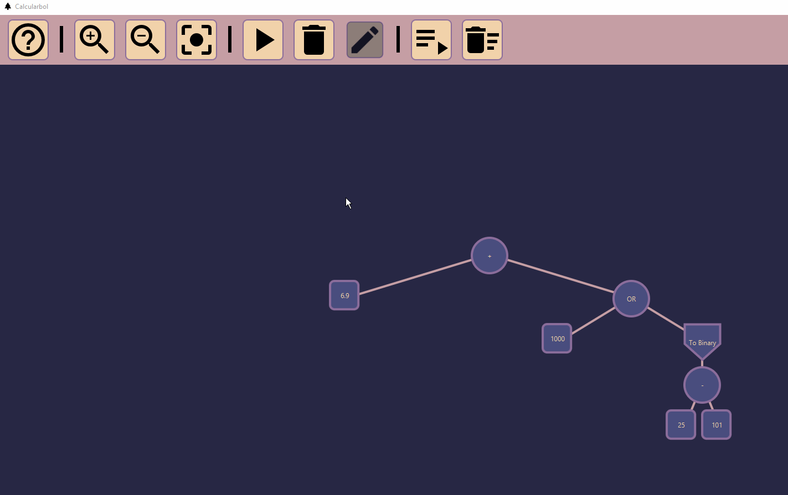
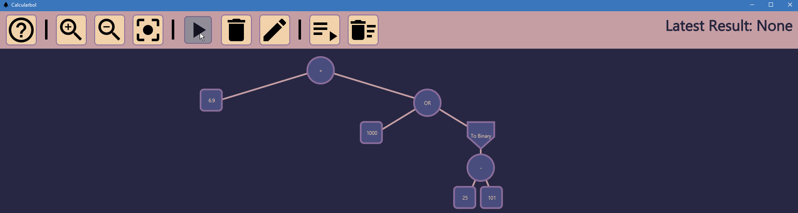
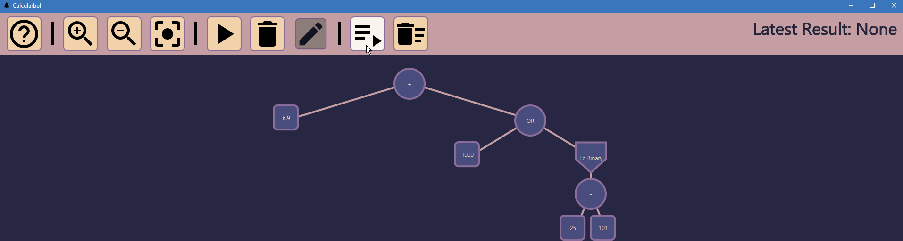
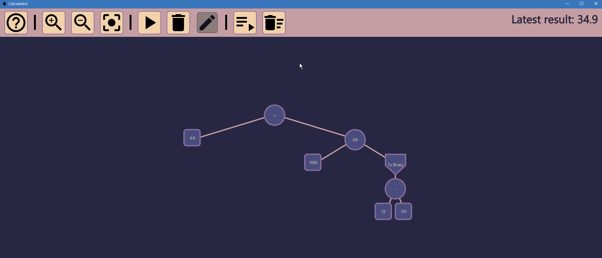
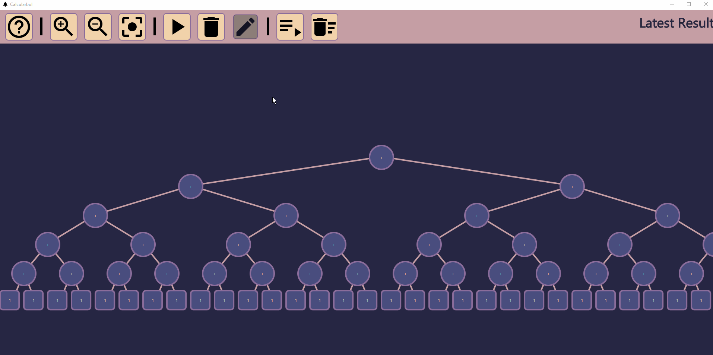
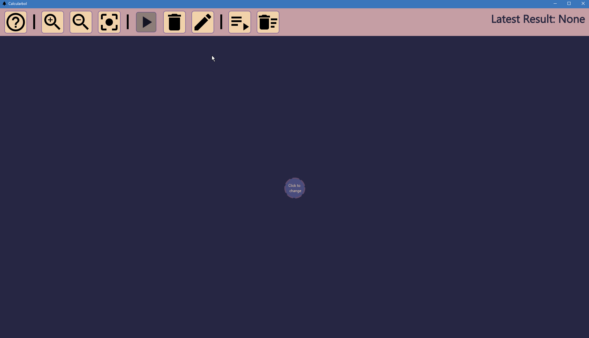

# Scrabble: AKA: CALCULARBOL

Interactive graphic programming language heavily inspired by 
[Scratch](https://scratch.mit.edu).
This work is licensed under a
[Creative Commons Attribution 4.0 International License](http://creativecommons.org/licenses/by/4.0/), 
and aims purely to be used with the purpose of teaching in the context of the course 
_CC3002 Metodologías de Diseño y programación_ of the 
[_Computer Sciences Department (DCC)_](https://www.dcc.uchile.cl) of the 
_University of Chile_.

Estudiante: Eric K.

Fecha comienzo: 08/Mayo/2021

---

# Front-End
Welcome to Calcularbol! The worlds (first?) binary-tree-based fully featured calculator!

## Running the program:
To run the program, simply use the run configuration in gradle.

## Using the program:

Calcularbol has a handy hyperlink back to this documentation!

### Navigating the workspace

You can drag the workspace, zoom in and out, and reset the view to see your trees better!

### Calculating

You can use the single calculate tool, and click on a node to evaluate it.

Or you can directly calculate the root node of the tree!

### Deleting

The software starts with a sample tree for you to experiment with, to reset the board you can use the trash all tool:

Or if you want finer control, you can delete specific nodes (and all their sub-nodes)

### Building your tree

You can edit blank nodes to your liking, setting the node child number, type, and value! (All details of what values are allowed, and what nodes types exist are listed below in the Back-End section)

# Back-End

## Exceptions

The program will warn you if you try to:
- Use an invalid value for a specific variable type
- Attempt an illegal operation (E.g: divide by zero)

The program will ignore the following exceptions:
- Missing visual assets (it will work regardless)
- Invalid operations (It will simply evaluate to null)

## MVC

### View
In the package: `cl.uchile.dcc.scrabble.gui` you can find all the classes relevant to the view.

### Controller
In the package: `controller` you can find all the classes relevant to the controller.

### Model

In the package: `model` you can find all the classes relevant to the controller.
The model corresponds to the following data structures and types:

#### Scrabble String
    ScrabbleString
    value <- Java String
##### Valid conversions:
* `toScrabbleString()`
##### Valid operations:
* `plus(other)` Note: Works as string concatenation.
  * with Scrabble String
  * with Scrabble Integer
  * with Scrabble Float
  * with Scrabble Binary
  * with Scrabble Bool

#### Scrabble Bool
    ScrabbleBool
    value <- Java Boolean
##### Valid conversions:
* `toScrabbleString()` Note: Converts to '0' or '1', not 'true' or 'false'.
* `toScrabbleBool()`
##### Valid operations:
* `not()`
* `and(other)`
  * with Scrabble Bool: operates as expected.
  * with Scrabble Binary: applies boolean value to every binary digit.
* `or(other)`
  * with Scrabble Bool: operates as expected.
  * with Scrabble Binary: applies boolean value to every binary digit.

#### Scrabble Float
    ScrabbleFloat
    value <- Java Double
    Note: Despite the name, it is actually a double, not a float.
##### Valid conversions:
* `toScrabbleString()`
* `toScrabbleFloat()`
##### Valid operations:
* `plus(other)`
  * with Scrabble Float
  * with Scrabble Int: Result is a Scrabble Float.
  * with Scrabble Binary: result is a Scrabble Float. 
* `minus(other)`
  * with Scrabble Float
  * with Scrabble Int: Result is a Scrabble Float.
  * with Scrabble Binary: result is a Scrabble Float. 
* `times(other)`
  * with Scrabble Float
  * with Scrabble Int: Result is a Scrabble Float.
  * with Scrabble Binary: result is a Scrabble Float. 
* `div(other)`
  * with Scrabble Float
  * with Scrabble Int: Result is a Scrabble Float.
  * with Scrabble Binary: result is a Scrabble Float. 

#### Scrabble Integer
    ScrabbleInt
    value <- Java Integer
##### Valid conversions:
* `toScrabbleString()`
* `toScrabbleFloat()` Note: Value becomes a double with decimal value 0.
* `toScrabbleInt()`
* `toScrabbleBinary()` Note: is 2's complement.
##### Valid operations:
* `plus(other)`
  * with Scrabble Float: Result is a Scrabble Float.
  * with Scrabble Int
  * with Scrabble Binary: result is a Scrabble Int.
* `minus(other)`
  * with Scrabble Float: Result is a Scrabble Float.
  * with Scrabble Int
  * with Scrabble Binary: result is a Scrabble Int.
* `times(other)`
  * with Scrabble Float: Result is a Scrabble Float.
  * with Scrabble Int
  * with Scrabble Binary: result is a Scrabble Int.
* `div(other)`
  * with Scrabble Float: Result is a Scrabble Float.
  * with Scrabble Int: Whole division (result is a Scrabble Int).
  * with Scrabble Binary: result is a Scrabble Int.

#### Scrabble Binary
    ScrabbleBinary
    value <- Java String
    Note: Value will always be 32 characters long!
##### Valid conversions:
* `toScrabbleString()`
* `toScrabbleFloat()` Note: is actually just Binary -> Int -> Double.
* `toScrabbleInt()` Note: is 2's complement.
* `toScrabbleBinary()`
##### Valid operations:
* `plus(other)`
  * with Scrabble Int: result is a Scrabble Binary
  * with Scrabble Binary
* `minus(other)`
  * with Scrabble Int: result is a Scrabble Binary
  * with Scrabble Binary
* `times(other)`
  * with Scrabble Int: result is a Scrabble Binary
  * with Scrabble Binary
* `div(other)`
  * with Scrabble Int: Whole division (result is a Scrabble Binary).
  * with Scrabble Binary
* `not()` Note: Inverts each character (all 32) individually.
* `and(other)`
  * with Scrabble Bool: applies boolean value to every binary digit.
  * with Scrabble Binary: operates each corresponding digit with each-other.
* `or(other)`
  * with Scrabble Bool: applies boolean value to every binary digit.
  * with Scrabble Binary: operates each corresponding digit with each-other.

- Also worth noting, there is a hidden ScrabbleNull for invalid operations.

### Variable Management

Not fully implemented yet but, instead of using `new ScrabbleVariable()` you can use the FlyweightFactory object's createVariable methods for efficient management of memory.
The FlyweightFactory object stores each variable with a name into a hashmap.

### Abstract Syntax Tree

For running programs, there is an abstract SyntaxTree. 
The tree is made of nodes. Every node can be evaluated, which will return a ScrabbleVariable described above.
Important note: if a node can't be evaluated (for example, because of invalid model.types in the operation), it will return null.
There are 3 different model.types of nodes:

### #End Nodes
When evaluated, they simply return the value stored within them.
* `NodeString` holds a ScrabbleString.
* `NodeBool` holds a ScrabbleBool.
* `NodeFloat` holds a ScrabbleFloat.
* `NodeInt` holds a ScrabbleInt.
* `NodeBinary` holds a ScrabbleBinary.

#### Unary Nodes
Has a single child node. When evaluated, it returns the evaluation of its child node operated with the operation of the node type.
* `NodeNot` negates the child node.
* `NodetoString` converts the child node to a ScrabbleString.
* `NodetoBool` converts the child node to a ScrabbleBool.
* `NodetoFloat` converts the child node to a ScrabbleFloat.
* `NodetoInt` converts the child node to a ScrabbleInt.
* `NodetoBinary` converts the child node to a ScrabbleBinary.

#### Binary Nodes
Has two child nodes (left and right). It applies the operation of the node type as a method to the evaluation of the left node, with the evaluation of the right node as the value.
* `NodePlus` plus method mentioned above.
* `NodeMinus` plus method mentioned above.
* `NodeTimes` times method mentioned above.
* `NodeDiv` div method mentioned above.
* `NodeAnd` and method mentioned above.
* `NodeOr` or method mentioned above.

Si estás leyendo esto, que tengas un buen dia/noche c:

